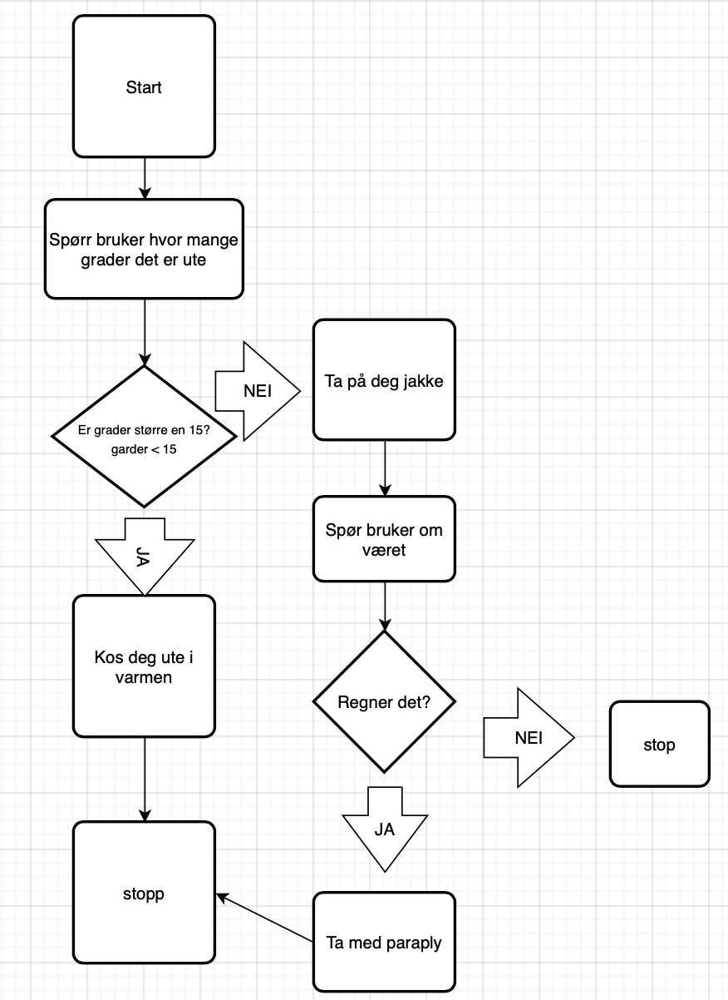
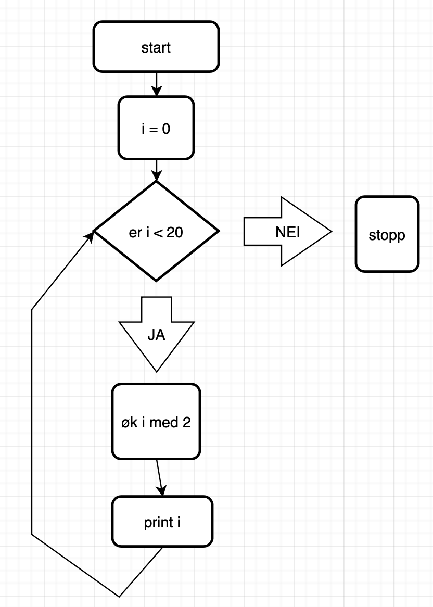

# Objektorienterte modeller som beskriver programstruktur

## UML
UML diagrammer brukes når man skal lage større eller mindre prosjekter med objektorientert programering.
IO er slikt UML diagram viser overikt over klassene programmene skal ha og hvilke metoder og egenskaper klassene skal ha.

## FLYT diagram
Flyt diagram/skjema brukes når man skal gi en skjematisk fremstilling av en prosess.
Det gjør det lettere å vise hva man fpr som output av ulike tilfeller i programmet-

I et flyt diagram viser diamatene valg, firkanten hva som skjer og pilene viser utfall av valg og hvor i programmet det fører

### Eksempel
[flyt-vaer.py](flyt-vaer.py)

[flyt_wjile.py](flyt_while.py)

