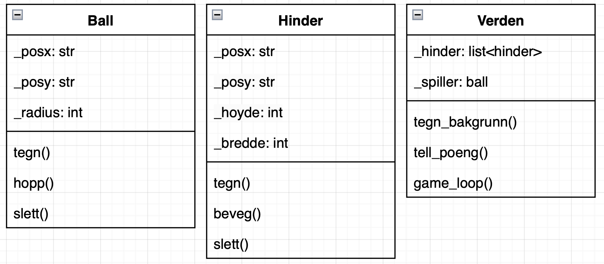

# Objektorienterte modeller som beskriver programstruktur

## UML
UML diagrammer brukes når man skal lage større eller mindre prosjekter med objektorientert programering.
IO er slikt UML diagram viser overikt over klassene programmene skal ha og hvilke metoder og egenskaper klassene skal ha.

